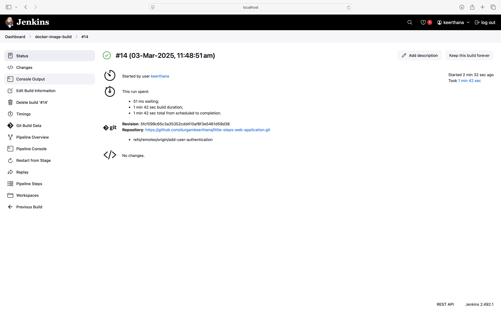
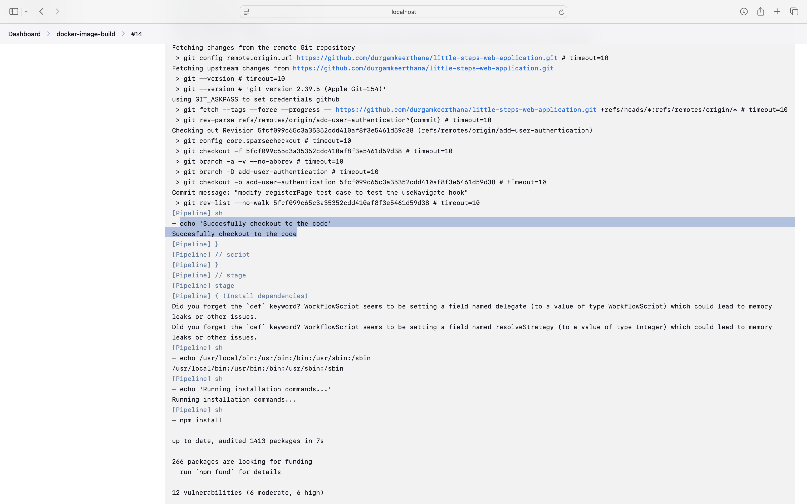
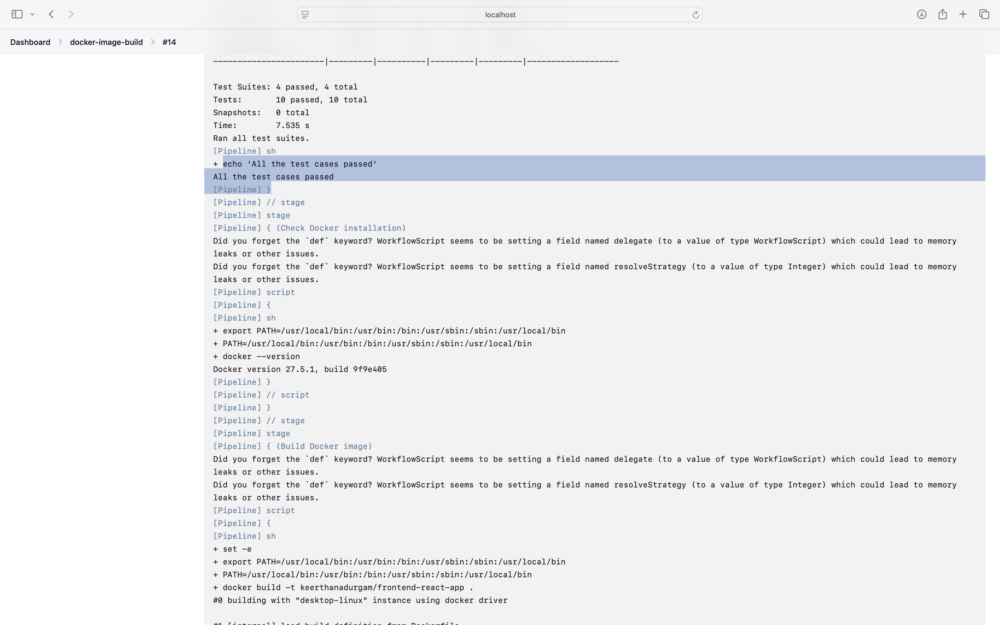
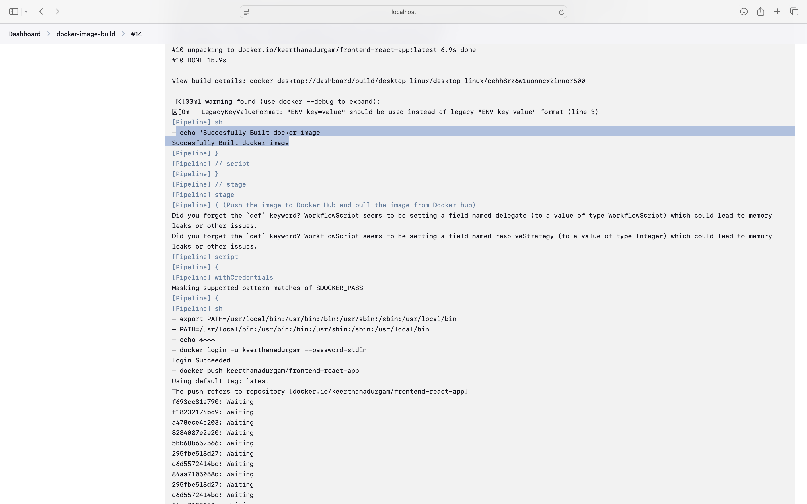

# build-docker-images-with-je kins-pipeline

## Description
I have written the jenkins pipeline to build docker images. It includes steps to install the npm dependencies, as it is node pplication, test cases along with covergae, and steps to install, build, tag and push the docker image. Here, I am attaching the pipeline along with the output images.
## Jenkins pipeline

```bash
pipeline {
    agent any
    environment {
        DOCKER_PATH = '/usr/local/bin'
        PATH = "/usr/local/bin:$PATH"
    }
    stages {
        stage('Git Checkout') {
            steps {
                script {
                    git branch: 'add-user-authentication',
                        credentialsId: 'github',
                        url: 'https://github.com/durgamkeerthana/little-steps-web-application.git'
                         sh 'echo "Succesfully checkout to the code"'
                }
            }
        }
        
        stage('Install dependencies') {
            steps {
                sh 'echo $PATH'  
                sh 'echo "Running installation commands..."'
                sh 'npm install' 
                 sh 'echo "Succesfully installed the dependencies"'
            }
        }
        
        stage('Run tests and check coverage') {
            steps {
                sh 'npm run test:coverage'
                sh 'echo "All the test cases passed"'
            }
        }
        
        stage('Check Docker installation') {
            steps {
                script {
                    sh """
                    export PATH=\$PATH:$DOCKER_PATH
                    docker --version || { echo "Docker not found"; exit 1; }
                    """
                }
            }
        }
        
        stage('Build Docker image') {
            steps {
                script {
                    sh """
                    set -e
                    export PATH=\$PATH:$DOCKER_PATH
                    docker build -t keerthanadurgam/frontend-react-app .
                    """
                    sh 'echo "Succesfully Built docker image"'
                }
            }
        }
        
        stage('Push the image to Docker Hub and pull the image from Docker hub') {
            steps {
                script {
                    withCredentials([usernamePassword(credentialsId: 'dockerhub', usernameVariable: 'DOCKER_USER', passwordVariable: 'DOCKER_PASS')]) {
                        sh """
                        export PATH=\$PATH:$DOCKER_PATH
                        echo \$DOCKER_PASS | docker login -u \$DOCKER_USER --password-stdin
                        docker push keerthanadurgam/frontend-react-app
                        docker pull keerthanadurgam/frontend-react-app
                        """
                        sh 'echo "Succesfully pushed image to the docker hub"'
                    }
                }
            }
        }
    }
}
```
## Output images for the jenkins pipeline
1. 
2. 
3. 
4. 
5. 
6. 


